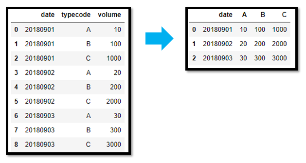
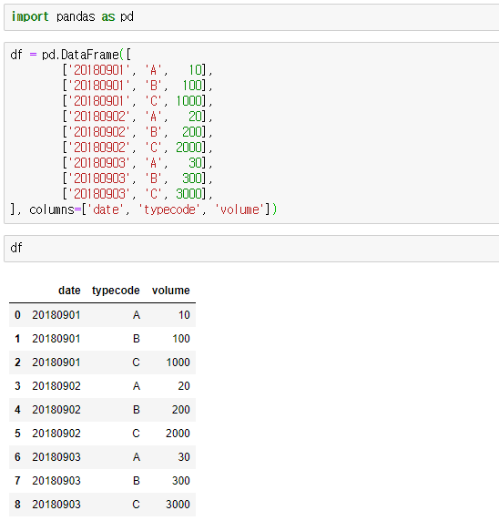
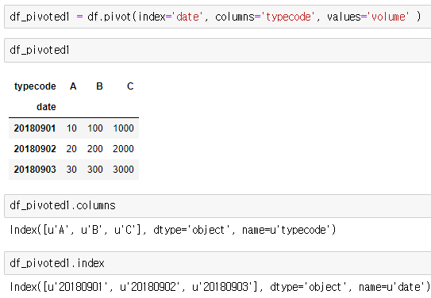

### 사전 지식(pandas)

- 행 데이터를 열 데이터로 회전 시키는 것을 Pivot 이라고 함.
- 특정 컬럼의 값들을 컬럼으로, 또 다른 컬럼은 특정 컬럼의 값으로 종속시킬 수 있다.

- 
- 
- 

- 위의 코드들을 보면 typecode 열들의 값이 column으로, volume 컬럼이 해당 컬럼에 맞는 value가 된 것을 확인 할 수 있다.

### rating_matrix

---

rating 데이터의 경우 user_id와 movie_id, 그리고 rating 값으로 이루어져 있다.

우리가 실행하려는 예측 방법은 **사용자 특성에 따라 집단으로 나누어서 예측하는 방법**이다.

그러므로 우리가 구한 rating 데이터(u.data) 에 사용자 특성 데이터(u.user)를 합칠 필요가 있으므로

평점 데이터의 full matrix를 구하려는 것이다.

(유저 데이터와 합치는 기준 컬럼은 user_id 이기 때문에 해당 column을 index로 지정해주는 것이다.)

여기서 **full matrix**란, 본래 사용자-영화-평점으로 이루어 져 있는 데이터를 feature engineering을 통해서

사용자와 영화를 각각 차원으로 mapping 한 array라고 볼 수 있다.

**유의 할 점** : 평가하지 않은 영화에 대해서는 NaN값을 가진다.

### score Function

---

파이썬도 JS처럼 함수로 일급 객체로 취급하는 듯 함.

이 코드에서 score Function 은 model 파라미터를 갖는데, 해당 파라미터는 함수를 값으로 받는다.

그래서 모델 함수를 넘겨받고, 유저와 영화의 테스트 데이터(x_test)를 입력하여 예측하고

평가 함수로 RMSE를 사용하여 넘겨준다.

예측 시 배열에 각각 모델 결과값을 담는다.

- y_pred 값은 모델 함수를 받아 user_id, movie_id를 넘겨주고 돌려받은 rating 값이다. 
- y_true 값은 데이터에서 가져온 rating 값이다.

np.array로 data 값을 배열로 만드는 특성이 있다. 그러나 평가 함수(RMSE)에서 혹시 몰라 한번 더 배열로 만들어주긴 한다.

**즉, score함수는 주어진 x데이터에서 모델 결과와 y값을 비교하는 함수 이다.**

**실제 실행과정**

- 함수들 설계
- 모델 함수 실행  (best-seller 모델 함수는 내부에 평점 평균 값을 집어넣음)
- 정확도 계산 (주어진 모델의 값과 실제 값의 RMSE 값 도출)
- 여기서 예측하는데 사용한 모델은 평점 평균 모델임
- 결과적으로 RMSE값이 증가함. **자신의 테스트 값으로 test하지 않았으므로 오차율이 증가**한 것임
  (자신의 데이터 값은 train_data에 들어있는데, 모델에서 예측해야하는 값은 test 값임)

데이터 병합(merge)

키 값을 기준으로 merge함, 

x_train : rating 데이터임, user_id, movie_id, rating, M:N 테이블임

users : 유저데이터, 성별 직업 등.. 

merge시 알아서 키 값을 통해 병합됨

### cf_gender

---

젠더 기준 추천

앞에서 사용했던 것 처럼 score 함수를 평가함수로 사용함.

- 먼저 현재 전체 평점 매트릭스에 movie_id가 없는 경우 (훈련 데이터에 영화가 없으므로)
  - 평점 3.0을 부여한다.
- 있는 경우에 유저 데이터에서 성별을 불러온다.
- 영화에 있는 성별 평균 평점 데이터에 성별이 없는 경우 (평점을 남긴 사람이 없는 것이므로)
  - 이 경우에도 평점 3.0을 부여한다.
- 최종적으로 gender_rating에 영화 성별 평균 평점 점수를 리턴한다.

score 함수에 적용 시 딱히 성능이 나아지지 않은 것을 볼 수 있다.

### Summary

---

1. 모든 모델 함수 (best_seller, cf_gender) 는 훈련데이터(train_data)로 이루어진 전체 매트릭스(rating_matrix) 값을 값을 사용해서 예측한다.
2. 평가 함수 score function은 예측해야 하는 값(y_pred)을 모델에 넘겨주어 오차(RMSE)를 계산한다.
3. 훈련 데이터를 이용해서 평균값을 예측하고, 실제 계산 시에는 test 값을 넘겨받아 모델에서 계산한 후 오차를 계산한다.